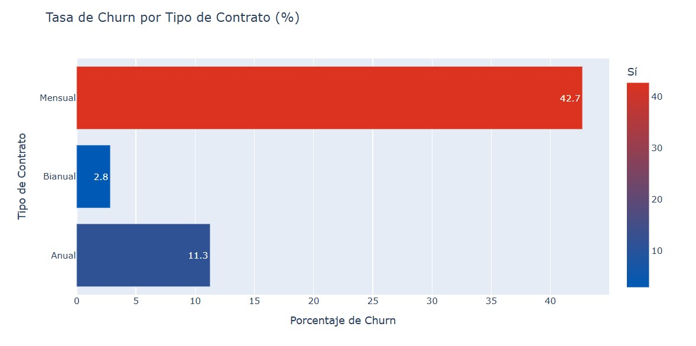
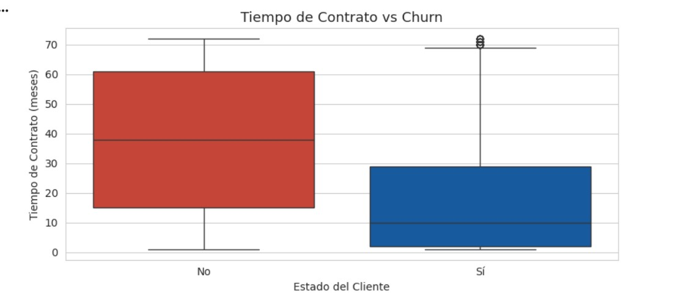

# 📊 Telecom X - Análisis de Churn

## 🚀 Abrir Proyecto

 

---

## 📌 Descripción

Este proyecto realiza un análisis exploratorio de datos para identificar los factores asociados a la evasión de clientes (Churn) en Telecom X.

El objetivo es detectar patrones que permitan comprender qué variables influyen en la cancelación del servicio y aportar información útil para estrategias de retención.

---

## 🛠️ Tecnologías utilizadas

- Python
- Pandas
- Plotly
- Seaborn
- Matplotlib
- Google Colab

---

## 🔎 Proceso del proyecto

1. Extracción de datos desde una API en formato JSON.
2. Transformación y limpieza del dataset.
3. Creación de variables adicionales.
4. Análisis exploratorio mediante visualizaciones.
5. Identificación de patrones relevantes.

---

## 📊 Visualizaciones Destacadas

### 📌 Tasa de Churn por Tipo de Contrato

---

### 📌 Tasa de Churn por Rango de Antigüedad

---

### 📌 Tiempo de Contrato vs Churn

---

## 📈 Principales Hallazgos

- Los contratos mensuales presentan mayor tasa de evasión.
- La baja antigüedad es el factor más asociado al churn.
- A mayor permanencia, menor probabilidad de cancelación.
- Clientes con mayor valor mensual muestran mayor tendencia a cancelar.

---

## 🎯 Conclusión

La evasión de clientes no ocurre de manera aleatoria. 
El tipo de contrato y la antigüedad del cliente son los principales factores asociados al churn.

Este análisis puede servir como base para el desarrollo de modelos predictivos y estrategias de retención.

---
## 💼 Autor
Maria Barbaran - Proyecto educativo de análisis de datos con Python realizado como parte del programa Data Science ONE (G9) de Alura LATAM.
